 

<table>
<tr>
<td align="center" width="140">
<strong>1+</strong> 
Years Building Production Apps
</td>
<td align="center" width="140">
<strong>10+</strong> 
Production Apps Shipped
</td>
<td align="center" width="140">
<strong>6</strong> 
Domains: POS, E-com, Logistics, HR
</td>
</tr>
</table>

 

 

## 👋 About Me

I'm a **Flutter & Dart Mobile/Desktop Developer** with hands-on experience shipping scalable, production-ready apps — from concept to deployment. I specialize in **GetX state management**, offline-first architecture, and clean, reactive UI.

I've worked across **POS systems, e-commerce platforms, logistics & delivery apps, gas depot operations software, and attendance/HR management systems** — building reliable products that solve real business problems.

 

## 🧩 Tech Stack

 

## 🚀 What I Build

| Domain | Highlights |
|---|---|
| 🔥 **LPG Gas Suite** | 6-app system — Customer, Gate Man, Driver, Dealer, Manager, Delivery apps with GetX, ESC/POS & PDF receipt printing |
| 🛒 **E-commerce** | Multi-vendor storefronts, cart/checkout flows, OTP auth, discount pricing engines |
| 💳 **POS Systems** | Offline-first SQLite sync, barcode scanning, staff management, Bengali currency PDF invoices |
| 🚚 **Logistics & Delivery** | Payment gateway integration, courier area mapping, real-time order tracking |
| 🕒 **Attendance/HR** | Role-based dashboards, salary reports with signatures, performance-optimized rebuilds |

 

## 📊 GitHub Stats

 

 

<strong>💜 Always Learning | Always Building 💜</strong>

