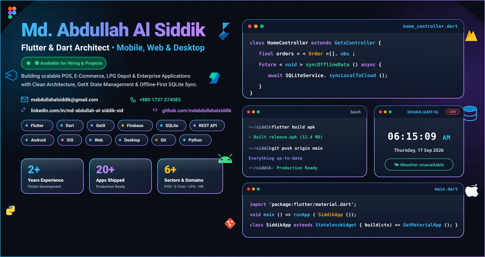

 

<!-- ================= QUICK CONTACT & LINKS BADGES ================= -->

 

<!-- ================= METRICS STATS TABLE ================= -->
<table align="center">
<tr>
<td align="center" width="200">
<h3>⚡ 2+ Years</h3>
<b>Experience</b> 
Flutter &amp; Dart Architect
</td>

<td align="center" width="200">
<h3>🚀 20+ Apps</h3>
<b>Production Delivered</b> 
Mobile • Web • Desktop
</td>

<td align="center" width="260">
<h3>🏭 6+ Sectors</h3>
<b>Industry Domains</b> 
POS • E-Commerce • LPG Depot • HR • Logistics
</td>
</tr>
</table>

 

## 👋 About Me

I am a **Flutter & Dart Mobile, Web, and Desktop Architect** with over 2 years of hands-on experience designing and deploying robust, production-grade applications. My core expertise centers on **GetX State Management**, **Clean Architecture**, **Offline-First SQLite Synchronization**, and responsive UI design across all platforms.

I specialize in building complex enterprise software suites, including **6-app LPG management ecosystems, offline POS systems with ESC/POS thermal printing, e-commerce platforms with payment integrations, logistics fleet tracking, and automated HR & attendance dashboards**. My goal is to build scalable, maintainable, and high-performance software solutions that solve real-world business challenges.

 

## 🧩 Tech Stack & Ecosystem

### 📱 Mobile & Cross-Platform Development

   &nbsp;
   &nbsp;
   &nbsp;
   &nbsp;
   &nbsp;
  

### ⚡ Architecture, State Management & APIs

  
  
  
  
  

### 🗄️ Database & Storage Solutions

   &nbsp;
   &nbsp;
  

### 🛠️ Developer Tools & Design Workflow

   &nbsp;
   &nbsp;
   &nbsp;
   &nbsp;
   &nbsp;
  

 

## 🚀 Featured Solutions & Ecosystem Showcase

| Ecosystem | Key Features & Architecture Highlights |
|:---|:---|
| 🔥 **LPG Management Suite** | Complete **6-App Ecosystem** — Customer, Dealer, Driver, Gate Man, Manager & Delivery Apps with GetX state management, ESC/POS Bluetooth/USB thermal printing, Bengali PDF invoice generation, offline SQLite caching, and depot inventory syncing. |
| 🛒 **E-Commerce & Retail Suite** | Modern retail application with dynamic product catalog, multi-currency cart & checkout, OTP authentication, Google Sign-In, payment gateway integration, coupon/discount engines, and live order tracking. |
| 💳 **Offline-First POS System** | Zero-latency retail cashier app with offline-first SQLite database sync, instant barcode scanning, receipt printing, customer credit ledger, stock management, and sales reporting. |
| 🚚 **Logistics & Delivery Fleet** | Real-time driver navigation workflow, intelligent route assignment, order status sync, payment on delivery (COD) collection, and dispatch management. |
| 👥 **HR & Attendance Dashboard** | Employee biometric/location attendance logging, role-based access control (RBAC), salary calculation, commission tracking, and PDF export reports. |
| 🌐 **Multi-Platform Enterprise Apps** | Unified Flutter codebase compiled natively for **Android, iOS, Web, and Windows Desktop** with adaptive UI layouts. |

 

## 📊 GitHub Analytics & Activity

  
   
  

 

<!-- Contribution Snake Animation -->

  

 

<!-- ================= FOOTER ================= -->

  

  <strong>⚡ Engineering Seamless Cross-Platform Experiences | Always Building, Always Innovating ⚡</strong>

